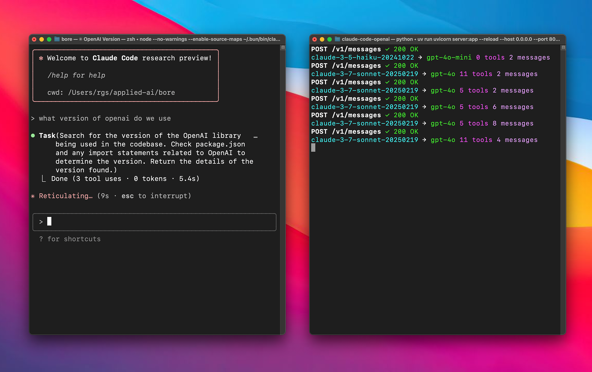

# Anthropic API Proxy for Gemini, OpenAI, and Anthropic Models

Use Anthropic-compatible clients such as Claude Code with Gemini, OpenAI, Codex subscription, or direct Anthropic backends. The proxy translates requests through a provider-neutral service layer and LiteLLM or Codex adapters.



## Quick Start

### Prerequisites

Choose prerequisites for targets in your `model_mapping.json`:

- Linux, Python 3.14.x, and [uv](https://docs.astral.sh/uv/) for source setup. Source `proxy` and host-side `ps` use a Linux-only secure Unix-socket backend.
- Docker with Docker Compose for container setup. Linux containers remain supported on macOS and Windows hosts.
- One or more provider credentials:
  - OpenAI API key for `openai/...` targets using LiteLLM.
  - Google AI Studio API key or Vertex AI Application Default Credentials for `gemini/...` targets.
  - Anthropic API key for `anthropic/...` targets.
  - OpenCode OAuth credentials for `openai/...` targets using Codex transport.

### Run from source

```bash
git clone https://github.com/Yimura/claude-code-proxy.git
cd claude-code-proxy
cp .env.example .env
uv sync --locked --dev
uv run claude-code-proxy proxy
```

Source `proxy` and host-side `ps` are supported on Linux only. On macOS or Windows, use the Docker setup below and run `ps` inside the Linux container.

Edit `.env` before starting. Configure only credentials required by targets in `model_mapping.json`. The `proxy` and `ps` commands read `.env` from the current working directory; already-exported environment variables win, and command options override both. The example binds source deployments to `127.0.0.1` because the public API does not authenticate inbound requests. The proxy command runs in the foreground.

### Run with Docker Compose

```bash
git clone https://github.com/Yimura/claude-code-proxy.git
cd claude-code-proxy
cp .env.example .env
docker compose up --build -d
```

The default Compose configuration makes the application listen on `0.0.0.0:8082` inside the container while publishing it only on `127.0.0.1:8082` on the host. `PROXY_PORT` changes the application listen port and both sides of the loopback-only publication together. Do not bind it to an external interface without adding authentication and network access controls; the proxy does not authenticate inbound requests.

Compose supplies repository `model_mapping.json` as a read-only application config at `/claude-code-proxy/model_mapping.json`. Edit the local file, then recreate the service to apply changes:

```bash
docker compose up --build -d --force-recreate
```

The image starts through the installed `claude-code-proxy` executable; `uv run` is not required inside the container. Query the running container with:

```bash
docker compose exec proxy claude-code-proxy ps
```

The image itself stays quiet: its `CMD` starts performance mode `off`. The repository's default Compose service overrides that complete `CMD` with collector mode:

```yaml
services:
  proxy:
    command: ["claude-code-proxy", "proxy", "--performance", "collector"]
```

This collects performance snapshots and events for `perf` and the future TUI without emitting terminal `performance outcome=...` records. Compose `command` replaces the image's complete `CMD`; it does not append arguments. Recreate the service after changing modes, then run snapshot or watch commands inside the container:

```bash
docker compose up --build -d --force-recreate
docker compose exec proxy claude-code-proxy perf
docker compose exec proxy claude-code-proxy perf --watch
docker compose exec proxy claude-code-proxy perf --watch --format json
```

For terminal performance records as well as collection, use the logging variant, then recreate the service:

```yaml
services:
  proxy:
    command: ["claude-code-proxy", "proxy", "--performance", "logging"]
```

Do not add both commands or try to extend the original `CMD`.

The default control socket is container-local at `/run/claude-code-proxy/control.sock`. It is not published or mounted, so a CLI running on the host cannot query the container unless you deliberately change the deployment. On macOS and Windows hosts, run `ps` or `perf` through `docker compose exec` as shown above; the source launcher and host-side control client are supported on Linux only.

### Connect Claude Code

Point your existing [Claude Code installation](https://code.claude.com/docs/en/setup) at the proxy:

```bash
ANTHROPIC_BASE_URL=http://localhost:8082 claude
```

## CLI and Session Inspection

Run the CLI without a subcommand to show help:

```bash
uv run claude-code-proxy
```

`proxy` is foreground-only; it does not fork, write a PID file, or manage a background daemon. Docker Compose's `restart: unless-stopped` policy supplies the container lifecycle. For source deployments, use your process manager when a daemon-like lifecycle is required. Direct Uvicorn application-target startup is retired, not deprecated or retained as a compatible startup path, because only the CLI coordinates both servers.

From the same source environment, inspect the running process over its local Unix socket:

```bash
uv run claude-code-proxy ps
uv run claude-code-proxy ps --filter state=active --filter provider=openai
uv run claude-code-proxy ps --filter session_id=abc123 --format json
uv run claude-code-proxy ps --format json
uv run claude-code-proxy ps --no-trunc
uv run claude-code-proxy ps --watch
uv run claude-code-proxy ps --watch --format json
```

Filters use `key=value` and may be repeated. Repeated values for one key are alternatives, while different keys are combined. Supported keys are `id`, `session_id`, `state`, `provider`, `transport`, `model`, and `effort`. `id` accepts an unambiguous prefix of the opaque public ID. `session_id` accepts an exact raw client session ID, hashes it internally, and returns only the matching opaque row; the raw value remains transient private-control input and is never included in registry snapshots or command output. Output defaults to a table, `--format json` returns the complete structured rows, and `--no-trunc` preserves full session and model values in table output. Source commands automatically select a socket under `XDG_RUNTIME_DIR` or another private runtime fallback. Use `--socket PATH` to override the socket for one command, or set `CONTROL_SOCKET_PATH` to an absolute socket path whose private parent directory already exists.

`ps --watch` table output renders the same normal `ps` table immediately, then refreshes it in place once per second. It requires TTY standard output and rewrites only rows owned by the previous frame; it does not clear or take over the whole terminal. With `--format json`, `ps --watch` works through pipes and non-TTY output as JSON Lines: one compact JSON array per line. Each array is a complete session snapshot with the same fields and ordering as one-shot JSON.

Each row has a safe, opaque, process-local hashed session ID. States are `active` while one or more requests are running, `idle` after the latest request completes, and `failed` after the latest request fails. Rows and their latest metadata are retained in memory only until the proxy process restarts; they are not prompt history. By default the registry retains the 1,000 most recently inactive logical rows, while active rows are never evicted.

The session registry excludes prompts and messages, system instructions, tool definitions, tool inputs and results, credentials, encrypted reasoning, and raw client session IDs. It records only the latest operational metadata needed for inspection, such as resolved model, provider, transport, effort, request counts, state, and timestamps.

The control app listens only on a local Unix socket and its routes are not added to the public TCP API. In Docker, that socket remains inside the container by default; use `docker compose exec proxy claude-code-proxy ps` to query it. A host-side CLI cannot access it unless you deliberately change the deployment.

### Performance telemetry

`ps` is always available, including when performance collection is disabled. Performance telemetry is an explicit process-start choice:

| Mode | Default | Collection, history, endpoints, `perf`, and TUI data | Terminal performance records |
|---|---:|---:|---:|
| `off` | Yes | No | No |
| `collector` | No | Yes | No |
| `logging` | No | Yes | Yes |

Start a source deployment in either enabled mode:

```bash
uv run claude-code-proxy proxy --performance collector
uv run claude-code-proxy proxy --performance logging
```

In a second terminal, read a snapshot or start an append-only watch:

```bash
uv run claude-code-proxy perf
uv run claude-code-proxy perf --filter state=active --filter provider=openai
uv run claude-code-proxy perf --filter session_id=abc123 --format json
uv run claude-code-proxy perf --format json
uv run claude-code-proxy perf --watch
uv run claude-code-proxy perf --watch --format json
```

Performance filters use the same `key=value` combination rules as `ps`; supported keys are `id`, `session_id`, `state`, `provider`, `transport`, `model`, and `effort`. The raw `session_id` filter is private control input that is HMAC-hashed before matching and is never returned.

The snapshot table contains `SESSION`, `MODEL`, `STATE`, request and active counts, latest elapsed time and TTFT, input/output token totals, cache ratio, tool-call and retry totals, and the latest result. JSON preserves the full process identity, capture time, cursor, safe session/agent identity, active requests, the latest 20 finalized requests per retained session, outcome counts, lifetime aggregates, concurrency, measurements, and safe failure diagnostics. `messages` operations can report input, output, cache, reasoning, tool, retry, duration, upstream-duration, and TTFT measurements. `count_tokens` operations report counted input tokens; output, cache, reasoning, tools, and TTFT are not applicable.

Every metric distinguishes three states. `observed` includes zero as a real value, `unavailable` means the provider or lifecycle did not expose a measurement, and `not_applicable` means the metric does not apply to that operation. Tables render the latter two as `—`, while JSON retains the status. TTFT starts at request acceptance and ends at the first non-empty client-visible text, reasoning, or tool event; a response with no such event remains unavailable rather than becoming observed zero. Cache ratio is cache-read tokens divided by total observed input plus cache-read and cache-creation tokens. `+?` marks a table aggregate or ratio as partial because at least one sample was unavailable; count-token samples make cache ratio not applicable.

History and aggregates are memory-only. Each retained session keeps its latest 20 finalized requests plus current active requests; lifetime aggregates cover the retained session row for the current process. A restart clears every row, aggregate, cursor, and event. The process-wide 4,096-event journal feeds each watcher through a bounded 64-event subscriber queue. Ordinary events carry increasing `sequence` values. A reset frame contains a current snapshot and its `cursor`; cursor-control frames advance filtered streams when an ordinary event does not match. A stale cursor, process mismatch, restart, or subscriber overflow produces another reset instead of pretending continuity.

`perf --watch` is an append-only performance event stream, not repeated session snapshots. It is snapshot-first when no valid resume cursor exists, then emits appended events. The CLI validates each NDJSON frame, emits each event once, does not reconnect, exits cleanly on an interrupt, and reports clean EOF rather than silently waiting on a replacement process.

### Interactive live TUI

The TUI requires performance collection and interactive TTY input and output. For a source deployment, start collector mode in one terminal and the dashboard in another:

```bash
uv run claude-code-proxy proxy --performance collector
uv run claude-code-proxy tui
```

The `logging` mode also supplies TUI data. Mode `off` does not: the command exits with a fixed, safe error naming control protocol v1 and the required `performance` and `performance_events` capabilities. Inside the default Compose service, collector mode is already enabled; attach an interactive terminal with:

```bash
docker compose exec proxy claude-code-proxy tui
```

The dashboard is keyboard-driven:

- ↑/↓ or `j`/`k` select; Tab/Shift+Tab switches between session and request panes.
- Enter opens or advances into details; Escape moves back or closes an overlay.
- `/` opens quick search, `f` adds a filter, `s` selects a sort, and `c` clears search and filters while preserving the current sort.
- `?` opens the in-app key reference; `q` or Ctrl+C exits cleanly.

Quick search updates locally while typing. It is a case-insensitive substring search across the safe public session ID, client and resolved model, provider, transport, stable state, transient phase, effort, and latest result. Filters are additive. Repeated filters for the same field are OR alternatives; different fields are ANDed. The public fields are `id`, `state`, `provider`, `transport`, `model`, and `effort`: `id` is a case-insensitive prefix match; all other public fields are case-insensitive exact matches. A `session_id` filter accepts an exact raw client session ID for private lookup. It is masked while entered, sent only to the local control endpoint, immediately cleared, HMAC-resolved by the proxy, and replaced in TUI state by safe public IDs; it is never displayed or retained.

Sorting supports baseline, session ID, state/phase, recency, model, elapsed, TTFT, input tokens, output tokens, cache ratio, or tool calls, in ascending or descending direction. Baseline order follows first observation and safe ID, with newly observed sessions appended. Equal observed values use safe ID as a deterministic tie-breaker. Unavailable sort values always remain last in either direction. Unavailable and not-applicable values render as `—`. Partial aggregates render with `+?`; zero remains a real observed value.

Responsive layouts switch by whole columns rather than truncating every metric. At 120 columns or wider, wide mode shows the full session metric set and the detail pane. At 90–119 columns, medium mode keeps model, state, request/activity, elapsed, TTFT, token, and result columns. Terminals narrower than 90 columns show the essential session, state/phase, elapsed, TTFT, and result columns; Enter opens full-width details. At any width shorter than 22 rows, the side detail pane is hidden and Enter opens the full-width detail view.

When the stream drops, the TUI retains the last snapshot as stale, marks the connection as disconnected/reconnecting, and retries after 0.5, 1, 2, and 4 seconds. A reset from a replacement proxy process is authoritative even when its sequence is lower: stale rows and cursor state are replaced before the header returns to CONNECTED. The command exits nonzero after retry exhaustion. Capability mismatch is not retried.

TUI state is ephemeral and memory-only. It disappears when the dashboard exits and is not an audit trail; durable console logs remain the operational record according to the deployment's storage and retention policy. The same exclusion boundary applies to both: neither the TUI nor application-managed telemetry/logging records prompts, messages, system instructions, tool names, descriptions, schemas, inputs or results, credentials, authorization values, API keys, encrypted reasoning, raw client session/agent identifiers, exception messages or locals, or provider request or response payloads.

Performance capabilities and routes remain on the Unix-socket control boundary. With mode `off`, health omits `performance` and `performance_events`, both `/v1/performance` and `/v1/performance/events` return 404, and `perf` exits with collector startup guidance. The endpoints are never added to the public TCP API. In Docker the socket remains container-local unless an operator deliberately changes the deployment boundary.

The privacy contract is exclusion-based. Captures, snapshots, journals, control JSON/NDJSON, CLI/TUI output, and structured performance records never retain or emit prompts, messages, system instructions, tool names, tool descriptions, tool schemas, tool inputs or results, credentials, authorization values, API keys, provider request or response payloads, exception messages or locals, encrypted reasoning, or raw client session, agent, or parent-agent IDs. Public session and agent IDs are process-local keyed HMAC values; request IDs are generated opaque values. Provider payloads still receive the content needed to execute the request, but that payload is not a telemetry surface.

This boundary follows OWASP ASVS 5.0.0 V13.2.2, V16.2.5, and V16.4.1 ([standard](https://github.com/OWASP/ASVS/tree/v5.0.0)), plus the OWASP [Logging Cheat Sheet](https://cheatsheetseries.owasp.org/cheatsheets/Logging_Cheat_Sheet.html) guidance to exclude or pseudonymize sensitive fields and safely encode log records, and the [Session Management Cheat Sheet](https://cheatsheetseries.owasp.org/cheatsheets/Session_Management_Cheat_Sheet.html) guidance to correlate with a salted hash instead of a raw session ID. This mapping is implementation guidance, not compliance certification.

## Logging and Failure Diagnostics

Console records use `timestamp - LEVEL - message`. Request records add an opaque, process-local `[session …]` or `[request …]` correlation label and, when present, an `[agent …]` label plus `parent=…`; request method, endpoint, client and upstream model names, provider, and effort provide operational context. These identifiers support correlation without recording prompt history or raw client session IDs.

The textual severity is always present. With color enabled, only the severity token is styled and reset before the message: DEBUG is dim, INFO is plain, WARNING is bold yellow, and ERROR/CRITICAL are bold red. Session and agent identity labels retain their separate palette; each styled token is reset within its entry so color does not bleed into following text or records. The presence of `NO_COLOR` (regardless of its value) disables both severity and identity ANSI styling without changing the semantic text fields.

Provider failure records use safe structured fields:

- `category`: `authentication`, `transport`, `upstream_http`, `provider_protocol`, `translation`, or `internal`.
- `stage`: `credentials`, `request`, `response`, `stream`, `provider_translation`, `client_translation`, or `route`.
- `code`: a stable, application-local diagnostic code.
- `provider_code`: optional provider error identity retained only when it exactly matches a conservative recognized-category allowlist.
- `status` and `retryable`: normalized HTTP/retry context when applicable.
- Unhandled exceptions captured at route or stream boundaries may additionally include only the exception class and an application-relative `module:function:line` location.

For example, a plain-text server record can look like:

```text
2026-09-19 12:00:00,000 - WARNING - [session 4f2c9a8d1e03] POST /v1/messages provider request failed category=upstream_http stage=response code=http_error provider_code=rate_limit_exceeded status=429 retryable=True model=client-model upstream=provider-model provider=codex effort=high
```

Diagnostic tokens are control-character encoded and bounded; `provider_code` is never a license to log an arbitrary provider body. The frozen diagnostic boundary retains only exact recognized categorical strings, such as `rate_limit_exceeded`, `insufficient_quota`, `invalid_prompt`, `content_policy_violation`, `authentication_error`, `server_error`, or `ECONNRESET`; unknown or empty strings and boolean or numeric values become unavailable. For Codex non-200 responses, optional enrichment also requires Content-Encoding to be absent or `identity`, an ASCII-decimal Content-Length no greater than 4096 that exactly matches the raw bytes, UTF-8 JSON, and a top-level object containing a nested `error` object. A recognized string `error.code`, or recognized string `error.type` fallback, may then be retained. Otherwise `provider_code` is omitted and the body is never emitted.

Application-managed request and provider diagnostic records exclude prompts/messages/system instructions; tool definitions, inputs, and results; request/response bodies; headers; access and refresh tokens; API keys; credentials; connection strings; encrypted reasoning; raw provider payloads; and exception messages, exception locals, and full exception traceback paths. Provider failures returned through the proxy's HTTP and SSE adapters use generic client messages; the structured diagnostic fields above are emitted only in server logs. Framework and dependency logs are outside this contract.

Route middleware and provider/stream adapters coordinate exactly-once failure records at shared boundaries where the same failure propagates, but this boundary-level behavior is not a promise of global deduplication across processes, retries, or independently observed failures.

Structured terminal performance records are emitted only in `logging` performance mode. `collector` keeps the same in-memory metrics and control endpoints without those records, while `off` disables both. Existing startup, request, provider, stream, and failure diagnostics always remain in every mode; performance selection never suppresses failure evidence.

This contract supports OWASP ASVS 5.0.0 V13.2.2, V16.1.1, V16.2.1, V16.2.5, V16.4.1, and V16.5.1 ([standard](https://github.com/OWASP/ASVS/tree/v5.0.0)), together with the OWASP [Logging Cheat Sheet](https://cheatsheetseries.owasp.org/cheatsheets/Logging_Cheat_Sheet.html), [Session Management Cheat Sheet](https://cheatsheetseries.owasp.org/cheatsheets/Session_Management_Cheat_Sheet.html), and [Error Handling Cheat Sheet](https://cheatsheetseries.owasp.org/cheatsheets/Error_Handling_Cheat_Sheet.html). This mapping is implementation guidance, not compliance certification; operators remain responsible for deployment-level log storage, access, transport, retention, monitoring, and review.

## Environment Variables

Model selection belongs in `model_mapping.json`. Environment variables configure credentials, provider authentication, transport, and file locations. No environment variable enables performance telemetry; start `proxy` with `--performance collector` or `--performance logging` for that process. An exported variable cannot silently change the default `off` mode.

### Variable reference

| Variable | Purpose | Required when | Default |
|---|---|---|---|
| `ANTHROPIC_API_KEY` | Authenticates direct Anthropic requests | A mapping resolves to `anthropic/...` | Unset |
| `OPENAI_API_KEY` | Authenticates OpenAI or compatible API requests through LiteLLM | A mapping resolves to `openai/...` and `OPENAI_TRANSPORT=litellm` | Unset |
| `OPENAI_BASE_URL` | Overrides OpenAI-compatible API endpoint | Using a compatible endpoint instead of OpenAI | LiteLLM/OpenAI default |
| `GEMINI_API_KEY` | Authenticates Gemini through Google AI Studio | A mapping resolves to `gemini/...` and Vertex auth is disabled | Unset |
| `USE_VERTEX_AUTH` | Uses Google Application Default Credentials for Gemini | Gemini should use Vertex AI instead of an API key | `false` |
| `VERTEX_PROJECT` | Selects Google Cloud project | `USE_VERTEX_AUTH=true` | `unset` |
| `VERTEX_LOCATION` | Selects Vertex AI region | `USE_VERTEX_AUTH=true` | `unset` |
| `OPENAI_TRANSPORT` | Routes `openai/...` targets through `litellm` or `codex` | Optional | `litellm` |
| `LITELLM_LOCAL_MODEL_COST_MAP` | Selects LiteLLM bundled model-cost metadata instead of a startup refresh | Optional | `True` (set by the application) |
| `OPENCODE_DATA_DIR` | Locates OpenCode OAuth credentials used by Codex | `OPENAI_TRANSPORT=codex` | `~/.local/share/opencode` |
| `MODEL_MAPPING_PATH` | Selects model mapping JSON file | Mapping lives outside working directory | `model_mapping.json` |
| `PROXY_HOST` | Selects the public proxy bind host | Optional; keep source deployments on loopback unless external access is secured | Built-in: `0.0.0.0`; `.env.example`: `127.0.0.1`; Compose container: `0.0.0.0` |
| `PROXY_PORT` | Selects the public proxy TCP port; Compose applies it to the listener and loopback publication | Optional | `8082` |
| `CONTROL_SOCKET_PATH` | Overrides the private local control Unix socket path | Optional for source; must be absolute with an existing private parent | Automatic XDG/private fallback for source; image uses `/run/claude-code-proxy/control.sock` |
| `SESSION_RETENTION_LIMIT` | Sets the maximum inactive logical session rows retained in memory | Optional; must be an integer from `0` through `9223372036854775807` | `1000` |
| None — CLI only | No environment variable configures performance collection or logging | Use `proxy --performance off\|collector\|logging` at each process start | `off` |

Proxy startup uses LiteLLM's bundled model-cost metadata and does not refresh it over HTTP by default. The application sets `LITELLM_LOCAL_MODEL_COST_MAP=True` only when the variable is absent, so an explicit operator value is preserved. LiteLLM 1.101 recognizes only the case-insensitive literal `true` as local-only; set the variable explicitly to `False` to opt into LiteLLM's startup refresh, optionally from `LITELLM_MODEL_COST_MAP_URL`.

### Startup transport and Codex account

Before the public endpoint accepts requests, startup logs the effective OpenAI transport. When `OPENAI_TRANSPORT` is unset, the summary confirms the default:

```text
OpenAI transport: litellm
```

Codex startup resolves OpenCode authentication first, then reports the selected account and credential source:

```text
OpenAI transport: codex
OpenCode account: j***@crimson7.io [account-123] (opencode.db)
To use another account, stop the proxy, switch the active OpenAI account in OpenCode, and restart.
```

The email comes from a profile claim marked `email_verified` in the selected OpenCode access token and is masked before leaving the authentication component. If that claim is missing, malformed, or unverified, startup reports the non-secret account ID instead. Sources are `opencode.db` for the active OpenAI database credential and `auth.json` for the fallback credential. Startup output never includes a full email address, access token, refresh token, complete credential record, or unmasked token claims.

To switch accounts, stop the proxy, select the intended active OpenAI account in OpenCode, and restart the proxy. The proxy caches the resolved credential for the running process and does not switch accounts itself.

### Conflicting choices

| Choose one | Do not combine with | Why |
|---|---|---|
| `GEMINI_API_KEY` authentication | `USE_VERTEX_AUTH=true` | Vertex uses Application Default Credentials instead of Google AI Studio key authentication. |
| `OPENAI_TRANSPORT=litellm` | `OPENAI_TRANSPORT=codex` | One transport handles all resolved `openai/...` targets for a process. |
| Exact `model` selector | `tier` selector in same mapping | Each mapping entry must select exactly one target source. |

### Settings that belong together

| Configuration | Variables/files | Requirement |
|---|---|---|
| Vertex AI | `USE_VERTEX_AUTH=true`, `VERTEX_PROJECT`, `VERTEX_LOCATION` | Set all three; authenticate with Google Application Default Credentials. |
| Codex subscription | `OPENAI_TRANSPORT=codex`, `OPENCODE_DATA_DIR` | Directory must contain usable OpenCode OAuth credentials. |
| Custom OpenAI-compatible endpoint | `OPENAI_TRANSPORT=litellm`, `OPENAI_BASE_URL`, usually `OPENAI_API_KEY` | Mapping targets must use `openai/...`. |
| Tier mapping | `model_mapping.json` `tiers` and mapping `tier` | Every referenced tier must exist in top-level `tiers`. |

## Model Mapping

`model_mapping.json` is the source of truth for upstream model definitions, context capabilities, tier selection, Claude-name matching, and default reasoning effort:

```json
{
  "models": {
    "terra": {
      "target": "openai/gpt-5.6-terra",
      "context_window": 1000000
    },
    "sol": {
      "target": "openai/gpt-5.6-sol",
      "context_window": 1000000
    }
  },
  "tiers": {
    "small": "terra",
    "big": "sol"
  },
  "mappings": {
    "haiku": {"tier": "small", "effort": "medium"},
    "sonnet": {"tier": "big", "effort": "medium"},
    "opus": {"tier": "big", "effort": "high"},
    "fable": {"model": "sol", "effort": "xhigh"}
  }
}
```

Every model definition requires:

- `target`: exact upstream provider model.
- `context_window`: positive token count up to `9223372036854775807`, or `null` when capability is unknown.

Tier values reference model-definition names. Each mapping selects exactly one model definition:

- `"tier": "big"` resolves through `tiers.big`.
- `"model": "sol"` bypasses tiers and selects `models.sol` directly.

Raw provider targets are no longer valid in `tiers` or mapping `model` selectors. Move each target into `models`, then reference its definition name. Invalid and unknown references stop startup with a path-specific error.

Model mapping maintains three separate identities:

1. `original_model` preserves the exact inbound value for conservative prompt matching and logging.
2. `model` names the resolved upstream target used for provider routing, execution, and upstream system identity.
3. `response_model` advertises the client-facing Claude Code capability identity.

For an explicitly mapped model with a known context window, response identity is canonicalized from the inbound model. A context window of at least 1,000,000 tokens adds one terminal `[1m]` suffix; a smaller known window removes it. `context_window: null` advertises no capability and preserves the previous upstream response identity. Direct and unmapped requests preserve existing behavior.

Use explicit prefixes in model-definition targets to select providers:

- `openai/...` uses `OPENAI_TRANSPORT` (`litellm` by default, or `codex`).
- `gemini/...` uses LiteLLM with Google AI Studio or Vertex AI authentication.
- `anthropic/...` uses LiteLLM with Anthropic authentication.
- Unprefixed targets default to `openai/...`; explicit prefixes are recommended.

When Claude Code includes recognized model-identity metadata, mapped requests keep Claude Code identified as the coding-agent CLI harness while naming the exact resolved upstream target as the model generating the response. OpenAI and Gemini targets explicitly state that they are not Anthropic Claude models. Response identity does not change this upstream prompt identity. Unmapped requests, unrecognized metadata, and unrelated system instructions remain unchanged.

For direct Anthropic mappings, define and select Anthropic targets explicitly:

```json
{
  "models": {
    "haiku": {
      "target": "anthropic/claude-haiku-4-5-20251001",
      "context_window": 200000
    },
    "sonnet": {
      "target": "anthropic/claude-sonnet-5",
      "context_window": 1000000
    },
    "opus": {
      "target": "anthropic/claude-opus-5",
      "context_window": 1000000
    }
  },
  "tiers": {},
  "mappings": {
    "haiku": {"model": "haiku"},
    "sonnet": {"model": "sonnet"},
    "opus": {"model": "opus"}
  }
}
```

Valid mapping efforts are `none`, `minimal`, `low`, `medium`, `high`, and `xhigh`. Request controls override mapping defaults in this order:

1. `output_config.effort`
2. Enabled, adaptive, or disabled `thinking`
3. Mapping `effort`
4. Provider default

Incoming effort `max` maps to provider effort `high` for broad compatibility. Enabled or adaptive thinking without a configured effort uses `medium`. Disabled thinking omits upstream reasoning configuration.

If the configured mapping file does not exist, the proxy warns and uses built-in defaults. An existing but invalid file stops startup with a path-specific validation error.

## Codex Agent orchestration

For `OPENAI_TRANSPORT=codex`, `--codex-orchestration` accepts `off`, `advisory`, and `enforce` and defaults to `advisory`:

- `off` leaves the request's orchestration instructions and tool set unchanged.
- `advisory` adds role-aware orchestration guidance but does not remove tools.
- `enforce` adds the same guidance and omits `Agent` from unauthorized subagent requests before model execution. Top-level useful delegation remains available, and authorized nesting is allowed only within its configured depth. `SendMessage` remains available so an existing worker can be resumed for related fixes or rechecks.

The guidance tells models why the limits exist: prior runs showed excessive narrow forks, recursive delegation, duplicate review, repeated discovery, and avoidable token use. It asks parents to continue independent work after dispatch rather than poll; group related implementation, tests, fixes, and review under a few broad owners; reuse workers; stop discovery once current behavior, change location, constraints, and verification are known; and escalate genuine user preferences early. `TaskOutput` remains available for non-Agent background work. `Workflow` and `Skill` remain advisory and do not become automatic worker boundaries or enforcement mechanisms.

### Bounded nesting authorization

Nesting authorization is managed only through the private Unix-socket control API. The commands use the same private socket selection as other control commands:

```bash
uv run claude-code-proxy orchestration allow-nesting \
  --session-id SESSION --max-depth 2 --for 60m
uv run claude-code-proxy orchestration revoke-nesting \
  --session-id SESSION
uv run claude-code-proxy orchestration authorizations
```

`--for` accepts plain integer seconds or an integer with an `s`, `m`, or `h` suffix. It defaults to `60m`; the maximum is 24 hours. An authorization is process-local, expiring, and depth-bounded. The in-memory registry has a fixed capacity of 4,096 process-local authorization records, is lost when the proxy exits, and never crosses proxy processes. Expired tombstones count toward that capacity until reauthorization, explicit revocation, or session eviction. Creating a new entry when capacity is full returns HTTP 409; replacing an existing session entry remains possible.

Lineage is inferred only from caller-supplied session, agent, and parent-agent headers. The first-observed parent for an agent is immutable: a later conflicting parent makes lineage ambiguous rather than rewriting history. Missing, ambiguous, cyclic, expired, and over-depth lineage fails closed in `enforce` mode. This is a caller-supplied first-observed lineage limitation, not a cryptographic statement about worker identity.

Request activity is not worker lifecycle. The proxy sees requests, cancellations, disconnects, and failures, but no authoritative worker-completion event. Therefore active-worker count is explicitly unavailable, and retained or active request counts are not substitutes. The proxy also has no repository revision signal, so unchanged-revision review deduplication is explicitly unavailable. These unavailable values are reported as `{\"status\":\"unavailable\",\"value\":null}` rather than inferred.

LiteLLM, Gemini, and direct Anthropic requests are unaffected by this Codex-local policy.

### Billable live evaluation

The live evaluator calls a real Codex model and is excluded from required CI. It is skipped unless `RUN_CODEX_AGENT_EVAL=1` is set. Run a separate proxy process for each `off`, `advisory`, and `enforce` mode, using separate ports and control sockets. For example:

```bash
uv run claude-code-proxy proxy \
  --codex-orchestration advisory \
  --socket /path/to/advisory.sock \
  --port 8083

RUN_CODEX_AGENT_EVAL=1 \
CODEX_AGENT_EVAL_TRIALS=5 \
CODEX_AGENT_EVAL_MODEL=claude-opus-5 \
CODEX_AGENT_EVAL_REPORT=report-advisory.json \
ANTHROPIC_BASE_URL=http://127.0.0.1:8083 \
CONTROL_SOCKET_PATH=/path/to/advisory.sock \
uv run pytest -q -s test/integration/test_codex_agent_polling.py
```

Repeat with separate proxy processes and report paths for `off` and `enforce`. `CODEX_AGENT_EVAL_TRIALS` defaults to five trials and accepts an exact positive integer up to 100. Each trial uses a unique raw session identifier in memory. The evaluator writes one privacy-safe aggregate report atomically after all scenarios finish; it never writes prompts, responses, transcripts, raw session IDs, or Agent input dictionaries. It reports only the allowlisted schema, health-reported mode, model, scenario rates and aggregate counters, closed failure codes, and explicit unavailable metrics.

Compare reports with:

```bash
uv run scripts/compare-codex-agent-evals \
  report-off.json report-advisory.json
uv run scripts/compare-codex-agent-evals \
  report-advisory.json report-enforce.json
```

Each comparison input report is limited to 1 MiB and is rejected before JSON parsing when larger. The comparison requires matching models, trial counts, and the fixed scenario allowlist. It exits 1 if trial counts are incompatible, outcome completeness decreases, or prohibited behavior regresses. Lower token use never compensates for lower completeness.

## How It Works

1. The CLI starts the public TCP proxy and a separate private local control app on a Unix socket. Control routes are never registered on the public TCP listener.
2. The public app receives an Anthropic-compatible request.
3. The proxy resolves its model and reasoning policy through `model_mapping.json`.
4. The proxy selects LiteLLM or Codex transport.
5. The proxy translates and sends the upstream request.
6. The proxy normalizes streaming or non-streaming output into Anthropic-compatible responses and updates in-memory session metadata.

## Development

Application code lives in `src/claude_code_proxy/`; CLI coordination is in `cli.py`, the local control app and socket support are under `control/`, session metadata is in `observability.py`, and unit tests live in `test/unit/`.

```bash
uv sync --locked --dev
uv run pytest
uv run claude-code-proxy proxy
```

Before refreshing dependencies, review and update direct constraints in `pyproject.toml`. Then regenerate and verify the lock for the supported Python series:

```bash
uv lock --python 3.14 --upgrade
uv sync --locked --dev
uv run pytest
```

Validate Compose wiring without requiring a populated `.env`:

```bash
docker compose config --no-env-resolution --quiet
```

## Contributing

Contributions are welcome. Open an issue or pull request with tests for behavior changes.
